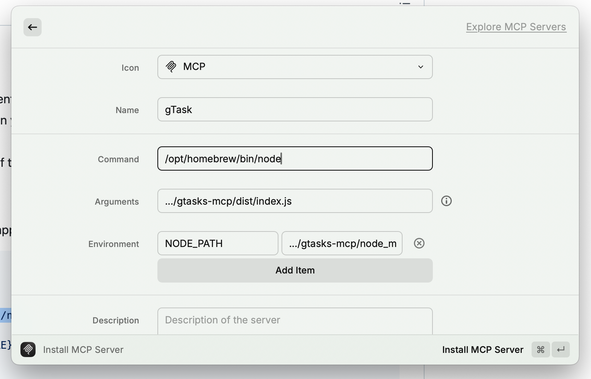

# Google Tasks MCP Server for Raycast

A Model Context Protocol (MCP) server for Google Tasks integration with Raycast. This server enables seamless task management directly from Raycast using natural language commands.

## Features

- 📝 **Full CRUD Operations**: Create, read, update, delete, and search Google Tasks
- 🔍 **Smart Search**: Search through tasks by title and notes
- 📋 **List Management**: Work with multiple task lists
- ⚡ **Fast Integration**: Easy installation via Raycast MCP Registry
- 🛡️ **Privacy-First**: OAuth credentials stored locally, never shared
- 🔒 **Secure**: Input validation, sanitization, and error handling to prevent security vulnerabilities

### Todo

  - ⌛ Add auto prio/urgent labeling
  - ⌛ Add weekly schedual assistant

## Components

### Tools

- **search**
  - Search for tasks in Google Tasks
  - Input: `query` (string): Search query (max 500 characters)
  - Returns matching tasks with details

- **list**
  - List all tasks in Google Tasks
  - Optional input: `cursor` (string): Cursor for pagination
  - Returns a list of all tasks

- **create**
  - Create a new task in Google Tasks
  - Input:
    - `taskListId` (string, optional): Task list ID
    - `title` (string, required): Task title (max 1024 characters)
    - `notes` (string, optional): Task notes (max 8192 characters)
    - `due` (string, optional): Due date
  - Returns confirmation of task creation

- **update**
  - Update an existing task in Google Tasks
  - Input:
    - `taskListId` (string, optional): Task list ID
    - `id` (string, required): Task ID
    - `uri` (string, required): Task URI
    - `title` (string, optional): New task title (max 1024 characters)
    - `notes` (string, optional): New task notes (max 8192 characters)
    - `status` (string, optional): New task status ("needsAction" or "completed")
    - `due` (string, optional): New due date
  - Returns confirmation of task update

- **delete**
  - Delete a task in Google Tasks
  - Input:
    - `taskListId` (string, required): Task list ID
    - `id` (string, required): Task ID
  - Returns confirmation of task deletion

- **clear**
  - Clear completed tasks from a Google Tasks task list
  - Input: `taskListId` (string, required): Task list ID
  - Returns confirmation of cleared tasks

### Resources

The server provides access to Google Tasks resources:

- **Tasks** (`gtasks:///<task_id>`)
  - Represents individual tasks in Google Tasks
  - Supports reading task details including title, status, due date, notes, and other metadata
  - Can be listed, read, created, updated, and deleted using the provided tools

## Security Features

This MCP server includes several security enhancements:

- **Input Validation**: All user inputs are validated for length limits and sanitized to prevent injection attacks
- **Error Handling**: Error messages are sanitized to prevent information disclosure
- **Container Security**: Docker image runs as non-root user with minimal permissions
- **Credential Management**: OAuth credentials are stored securely and excluded from version control

### Security Considerations

- Keep your OAuth credentials (`gcp-oauth.keys.json`) secure and never commit them to version control
- Regularly update dependencies to patch security vulnerabilities
- Monitor API usage for unusual patterns
- Use the principle of least privilege when configuring OAuth scopes

## Installation for Raycast

### Prerequisites

1. [Create a new Google Cloud project](https://console.cloud.google.com/projectcreate)
2. [Enable the Google Tasks API](https://console.cloud.google.com/workspace-api/products)
3. [Configure an OAuth consent screen](https://console.cloud.google.com/apis/credentials/consent) ("internal" is fine for testing)
4. Add scopes `https://www.googleapis.com/auth/tasks`
5. [Create an OAuth Client ID](https://console.cloud.google.com/apis/credentials/oauthclient) for application type "Desktop App"
6. Download the JSON file of your client's OAuth keys
7. Clone this repository and rename the key file to `gcp-oauth.keys.json` in the root directory

### Setup

1. **Clone and build the server:**
   ```bash
   git clone <this-repository>
   cd gtasks-mcp
   npm install
   npm run build
   ```

2. **Authenticate with Google:**
   ```bash
   npm run auth
   ```
   This will open a browser window for OAuth authentication and save credentials locally.

3. **Install in Raycast MCP Registry:**
   - Open Raycast and search for "Model Context Protocol Registry"
   - Install the MCP Registry extension
   - Open the extension and click "Add Server"
   - Copy the configuration from `raycast-mcp-config.json` and update the paths:
     ```json
     {
       "name": "gTasks",
       "command": "/opt/homebrew/bin/node",
       "args": ["/your/full/path/to/gtasks-mcp/dist/index.js"],
       "env": {
         "NODE_PATH": "/your/full/path/to/gtasks-mcp/node_modules"
       }
     }
     ```
   - Replace `/your/full/path/to/gtasks-mcp/` with your actual project path (e.g., `/Users/yourname/projects/gtasks-mcp/`)



### Usage Examples in Raycast

Once installed, you can use natural language commands in Raycast AI:

- **"Show me my Google Tasks"** - Lists all your tasks
- **"Create a task 'Buy groceries' due tomorrow"** - Creates a new task
- **"Search for tasks about 'meeting'"** - Searches through your tasks
- **"Mark task completed"** - Updates task status
- **"Delete the task about 'old project'"** - Removes a task

## Development

### Local Development

```bash
npm install
npm run dev          # Watch mode for development
npm run build        # Build for production
npm run auth         # Authenticate with Google
npm start            # Run the server
```

### Testing the Server

You can test the server locally before installing in Raycast:

```bash
# Test authentication
npm run auth

# Test server startup
npm start
```

## Alternative Installation Methods

### For Claude Desktop

If you want to use this with Claude Desktop instead:

```json
{
  "mcpServers": {
    "gtasks": {
      "command": "node",
      "args": [
        "/path/to/your/gtasks-mcp/dist/index.js"
      ]
    }
  }
}
```

### For Other MCP Clients

This server follows the standard Model Context Protocol and can be used with any MCP-compatible client like Cursor, Windsurf, or other AI assistants that support MCP.

## Contributing

Contributions are welcome! Please feel free to submit a Pull Request.

## License

MIT License - see the [LICENSE](LICENSE) file for details.
